# Machine-Learning-and-Data-Science
Create a lot of projects and algorithms using machine learning algorithms

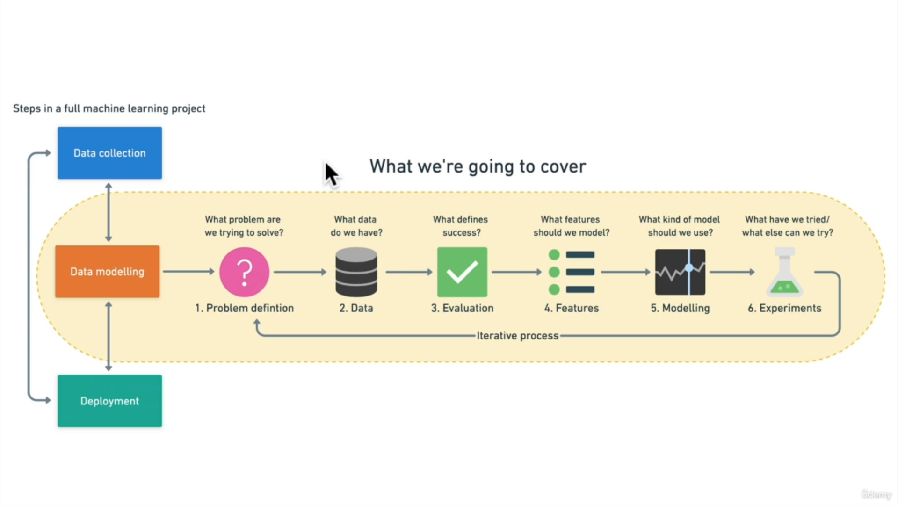

## Types of machine learning
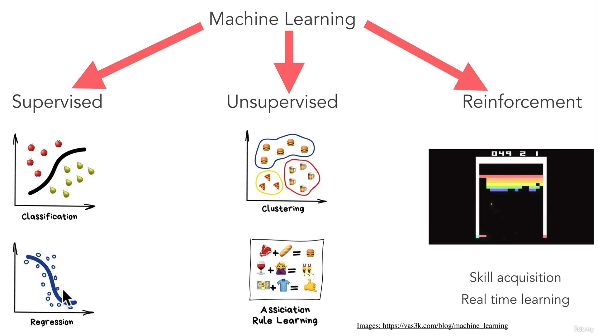

The only reason that we care about machine learning is that we're able to use machines to predict results based on incoming data .

and all this categories of machine learning do that :

* Supervised
    * Classification
    * Regession
* Unsupervised
    * Clustering
    * Association Rule Learning
* Reinforcement
    * Skill acquisition
    * Real time learning 

The idea is that machine learning has diffrent categories and different ways to accomplish it's goal and topics like , neural networks , decision trees , support vector machines , k nearest neighbor are simply algorithms that are used with these subfields , in order to come to these predictions .

but to remembre that all of these what they're doing is **Trying to learn from data that recieves and predict something** 

---

## What is machine learning

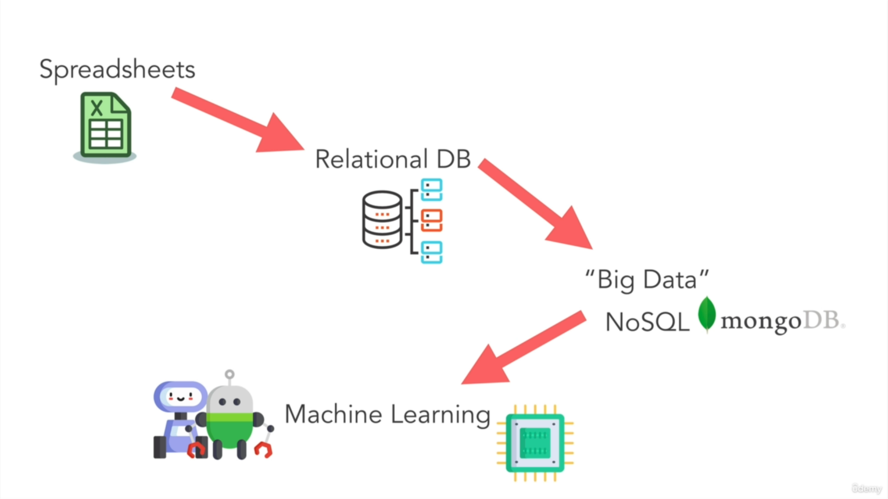

Actually machine learning is board but to keep it simple , machine learning is using an algorithm or computer , program to learn about different patterns in data , and then taking that algorithm and what it's learned to make predictions about the future using similar data .

Machine learning algorithms are also called models .

## Difference between data analysis and data science 

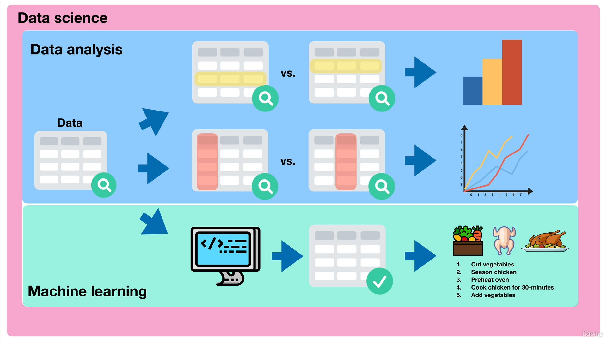

Data analysis is looking at set of data and gaining an understanding of it by comparing different  examples , different features and making visualizations graphs , as exemple is looking for the different ingredients , and asking the questions , what all the ingredeients have in common are some of them missing something which have the most of a certain type of thing 

Data science is running experiments on a set of data with the hopes of finding actionable insights within it .

one of these experiments may be to build a machine learning model , this model might look at 10000 different sets . ingredients and 10000 different chicken dishes , then tell us based on a set of new ingredients that we have , which chicken dish these ingredients are most likely to make .

You can consider data analysis and machine learning as a part of data science 

## The machine learning framework

So before start , i know that someon  of u had already heared before that yes , before start machine learning, u should learn mathematics , and statistics ... , yes this is important , trying to learn them all before getting started , getting hands on is like trying to boil the ocean .

Instead we will focus on , how to build pratical solutions and writing machine learning code to get insights out of data .

steps that u must do :

* Create a framework
* Match to data science and machine learning tools
* Learn by doing 

The steps that came again and again are :

* Problem Definition : What problem are we trying to solve ?
* Data : What data do we have ?
* Evaluation : What defines success ?
* Features : What features of model should we use ?
* Modeling : What kind of model should we use ?
* Experiments : What have we tried / what else can we try ?

### Step 1 : Problem definition :
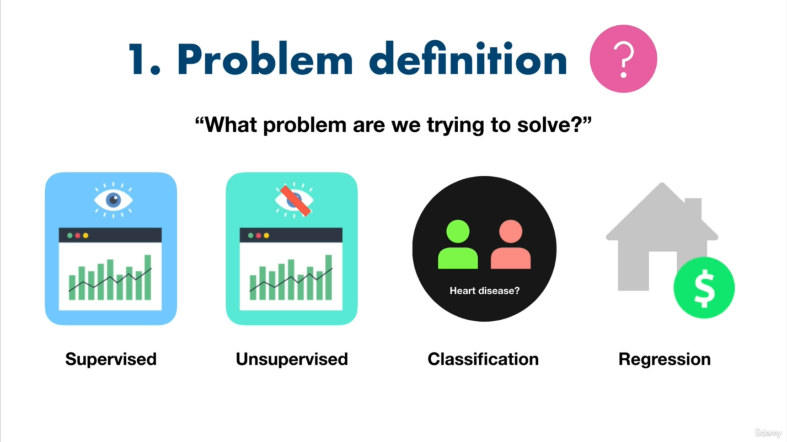

It's important to define what problem we trying to solve , supervised or unsupervised learning , classification or regression problem .

### Step 2 : Data
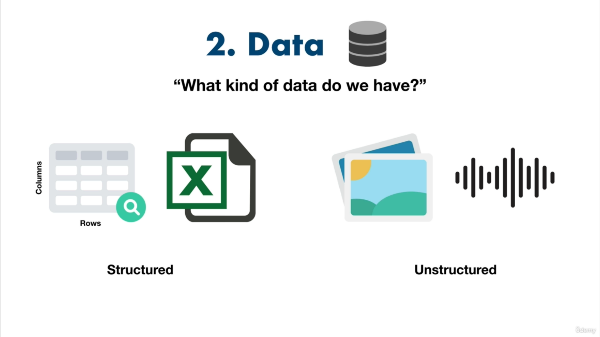

Data is a requirement for any machine learning project , the question is what kind of data that we have 

it depends on the project we can find a lot of different data , structured data (columns , rows) , unstructured data such as images and audio 

### Step 3 : Evaluation 
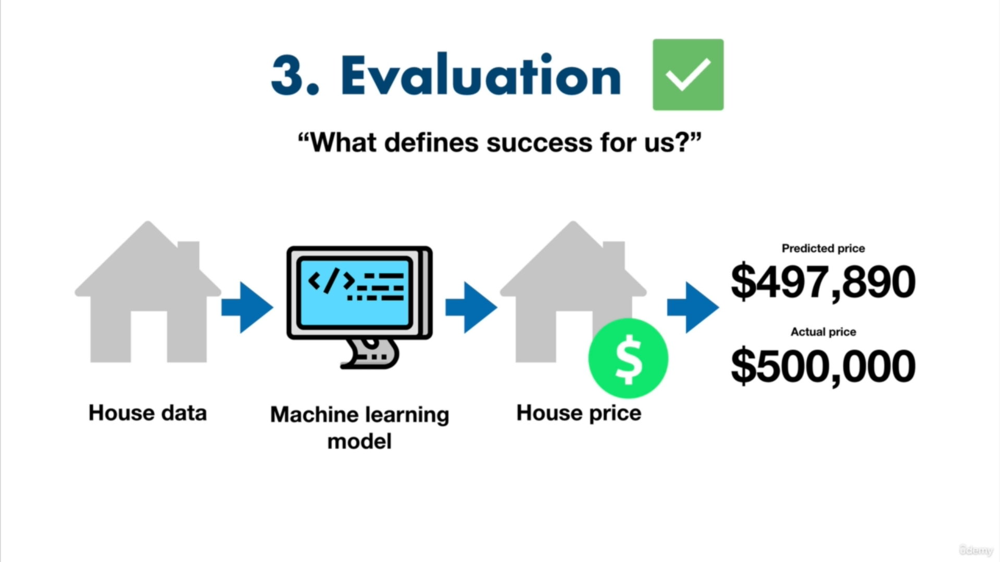

We answer the question what defines success for us ? , we know all that the perfect model don't exist so we must have a limit to stop our learning ,  instead we need some evaluation metric , that would not be exact in beginning , but we will change it over time .

### Step 4 : Features
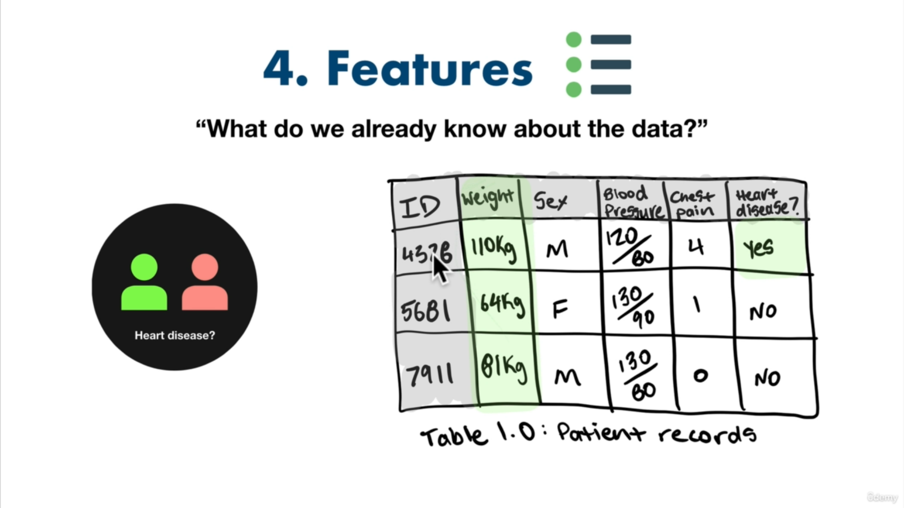

The question we ask here is : what do we already know about the data ?
for exemple to predict if someone or not heart disease? , you may use the body weight as a feature , body weight is a number so we call it **numerical** feauture , and maybe if someone's weight is above some certain numver they're more likely to have heart disease , there are more kinds of features , such as **categorical** and **derived** .

### Step 5 : Modeling
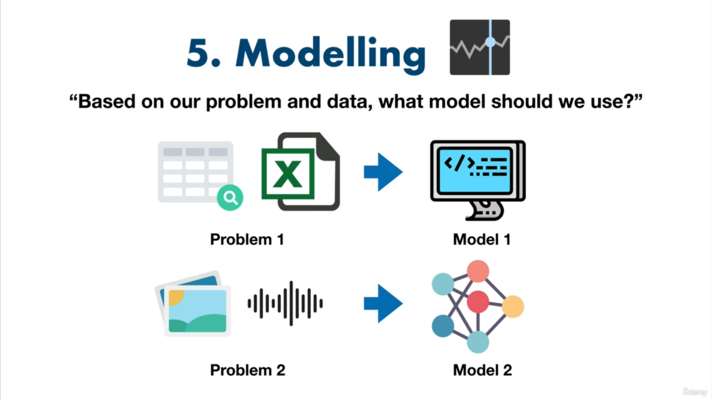

Once u've learned a little bit about your data the next step is to model it , the quetsion here is : Based on our problem and data , what model should we use?

### Step 6 : Experimentation
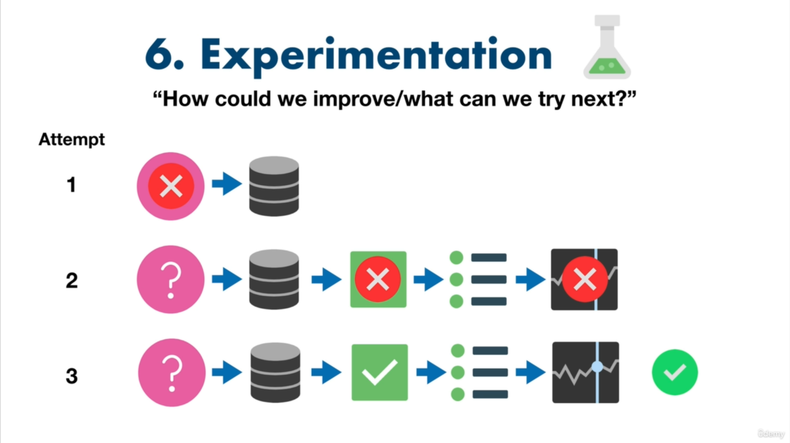

All the steps that we had been throught in a cycle , you might start out with one problem definition , and find your data isn't suited to it , then you might build a model and find it doesn't work as well as you outlined in your evaluation metric , so you will build another one and you find out this one actually works pretty good 

The Important to remembre is that those steps , don't need to bes followed in order , not are they set in stone , consider them a rough guide .

## Types of machine learning problems
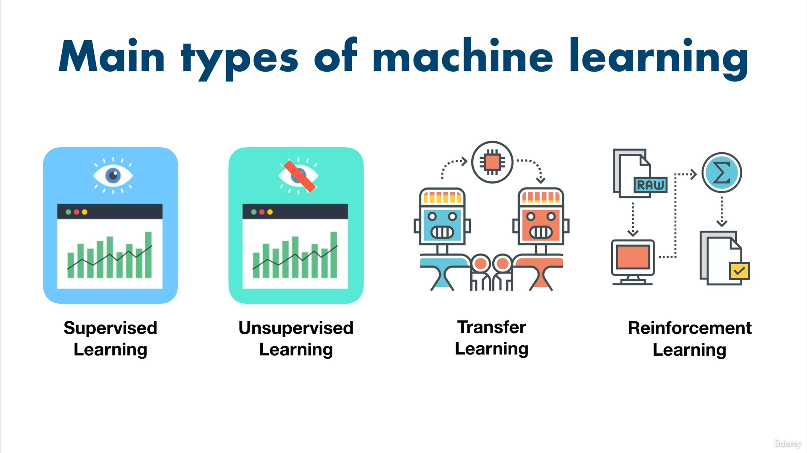

Important point to know is that machine learning is not solution for all problems ,so when we should not use machine learning , if a w simple hand-coded instruction based system work? so we should favourite this one than running machine learning algorithm  

so the first step is that we take our probklem and then we associate it to a kind of machine learning problems 

Main types of machine learning :

* Supervised learning 
* Unsupervised learning
* Transfer learning
* reinforcement learning

The first three are the most pratic one that you will work with others take a lot of time to get it work

**Supervised learning :** Amachine learning algorithm tries to use the data to predict a label , if it guess the label wrong the algorithm correct itself and tries again , this act of correction is why it called supervised 
-The main types of supervised learning problems are : classification and regression 

classification : we must just tell if an instance of a class belong to a class or another one , if we do have just 2 classes we say that it's binary classification otherwise it's multi-class classification .

Regression problems tries to find a number , a number which can go up or down , the traditional exemple is predict the sale price of a house based on things like number of rooms , and area ...

**Unsupervised learning :** has data but no label  , and you must just tell if it's belong to a class or to another one , classical exemple are clustering algorithms .
-typical problems : recommandation problems such as recommending what music someone should listen to based on their previous music choices , often start out as unsupervised learning problem like this .

**Transfer learning :** leverages what one machine learning model has learned in another machine learning 

for exemple to detect a dog in an image that have tree in the background , we can use a mdoel that has been already trained on trees detection , so we will use it and add the new model that we trying to create now .

**Reinforcement learning :** involves having a computer program perform some actions within a defined space and rewarding it for doing it well or punishing it for doing poorly , a good exemple is to teach a machine learning algorithm to play chess , the chess board is the divine space and the actions are moving pieces, and when ai say punishement or reward , these things could be as simple as updating a score with plus one if it wins or negative one if it loses , the machine learning algorithm will be to maximize the score .

## Types of Data :

What kind of data that we have , we do have two main types structured as csv and excel and unstructred data as images or signal or natural language text .
**Static data :** and as those values would not get changed over time we call them static data , machine learning is saying **The more data is better.**

**Streaming data :** is data , which is constantly changed over time , news headlines are being updated constantly , you'll want to be the first to see how they change the stocks . we use it a lot when we go into production or deployment

Data science workflow : begins with opening a CSV file in a jupyter notebook , then exploring the data and performing data analysis using pandas , and making visualisations such as graphs and comparing different data point using matplotlib , then building machine learning models on the data using  sickit-learn such machine learning model to predict using these patterns 

## Features :

The type of features which are the attribute , in general we do have just two types numerical and categorial types , but there is a concept of adding a new a new column or a new feature just by playing by the other ones , this concept called ***Feature engineering** , for exemple by taking a heart disease and the last date to know if in the current year have a heart disease or not 

**Feature engineering :** looking at different features of data and creating new ones/altering existing ones

when we have a feature column that the valid and existed data is less than **10%** we delete the feature or we try to collect more information 

**Feature coverage :** How many samples have diffrent features ? Ideally , every sample has the same feature 

so we must ensure that all the samples have the similar informations and this concept called **feature coverage**

## Modeling our data 

**This is the most important concept in machine learning**

## Modeling Part 1 Spliting :

we will go into 3 different section to model our data 

- Based on our problem and data , what model should we use ?

3 parts to modeling

* Choosing and trainging a model
    * Training data
* Tuning a model
    * Validation data
* Model comparaison
    * Test data

**The most important concept in machine learning : the training validation and test sets or 3 sets**

so we want to build a model to be in real world so that's why we will split it into three different sets a training set to tarin your model on ,  a validation set to churn your model on , and a test set to test and compare your different models  .

training split : (70-80%)  
validation split : (10-15%)
test split : (10-15%)

## Modeling Part 2 Choosing :

Unlike creating your algorithm from scratch there is a lot of prebuild machine learning model , u can take advantage of when u first begin , your goal will be what kinf of machine learning algorithm to use with what kind of problem 

but in general astuce to remeber if u're working with structured data , **decision trees such as random forest and gradient boosting algorithms like : CatBoost and XGBoost** , tend to work best 

and if u're working with unstructured data m deep learning , neural networks and transfer learning tend to work best .

once you choosen a model , your next step is to train them , the main goal here will be to line up inputs and outputs .

**Goal : Miminise time between experiments**

## Modeling Part 3 Tuning :

is choosing some type of params that u will work with , like in random forest , choose 3 or 5 trees for example , or in neural network how much number of layer do u wanna have 

Things to remeber : 
* Machine learning model have hyperparameters you can adjust
* A model first result aren't its last
* Tuning can take place on training or validation data sets

## Modeling Part 4 Comparaison :

The test set that give you how you model will perform once deployed in production

a good modle will yield similar result on the training , validation and test sets , and it's not uncommon 

what you should be worried about if the training set performance is dramaticly higher than the test set (64% , 47% , underfitting)  , or if the test set performance is higher than the training set performance also known as overfitting 

ideal something like : (training : 98 , test : 96)

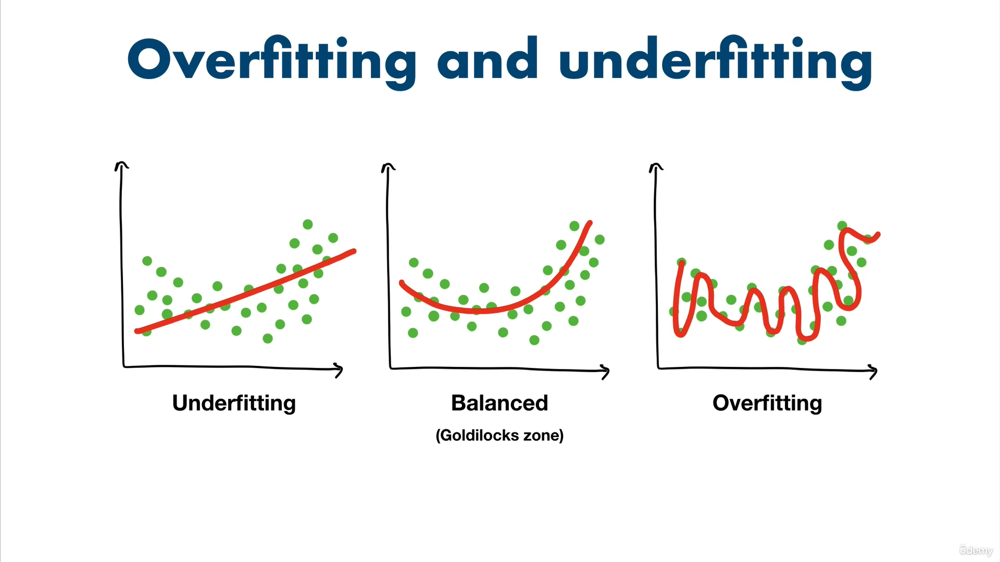

